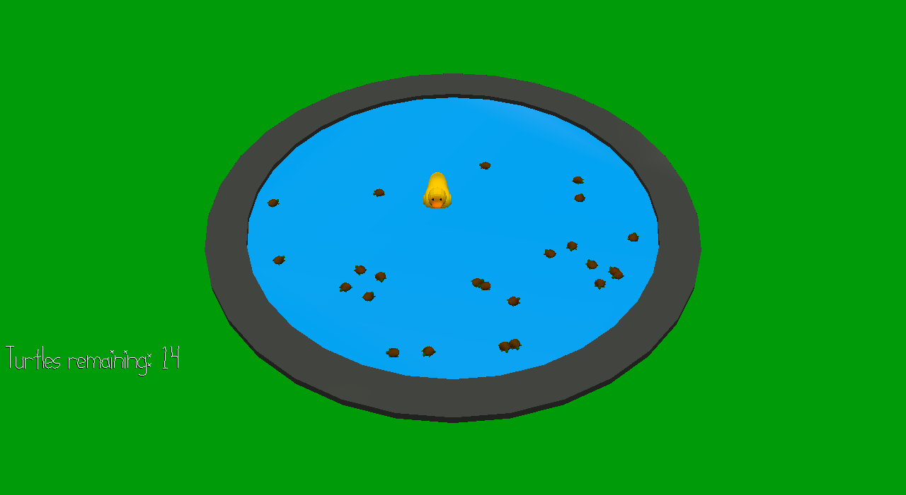

# Turtle Trouble!

Author: Lawrence Chen

Design: A game where your goal is to eat turtles and grow bigger. However, there are hidden assassin turtles that will kill you if you touch them. You can avoid them by pinging a radar that plays a sound indicating the distance to the closest assassin.

Screen Shot:

How To Play:
Use arrow keys to move, space to move faster, and Z to ping for assassins. The pitch of the sound is determined by the distance to the closest assassin.

This game was built with [NEST](NEST.md).
